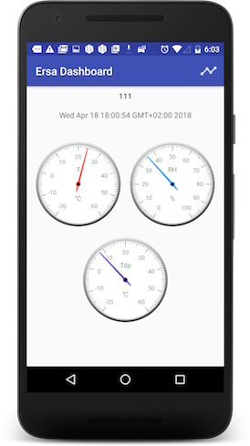

# ErsaAndroid
Ersa Android Client

- Retrieves and displays environmental variables from Ersa sensors.
- Calculates and displays the dew point.
- Predicts environmental hazards (e.g. mold, corrosion) and material preservation.

Uses:
- Android Architecture Components: ViewModel, LiveData
- Retrofit
- [Ersa](https://github.com/Pygmalion69/Ersa)
- [Gauge View](https://github.com/Pygmalion69/Gauge);
- [MPAndroidChart](https://github.com/PhilJay/MPAndroidChart)
